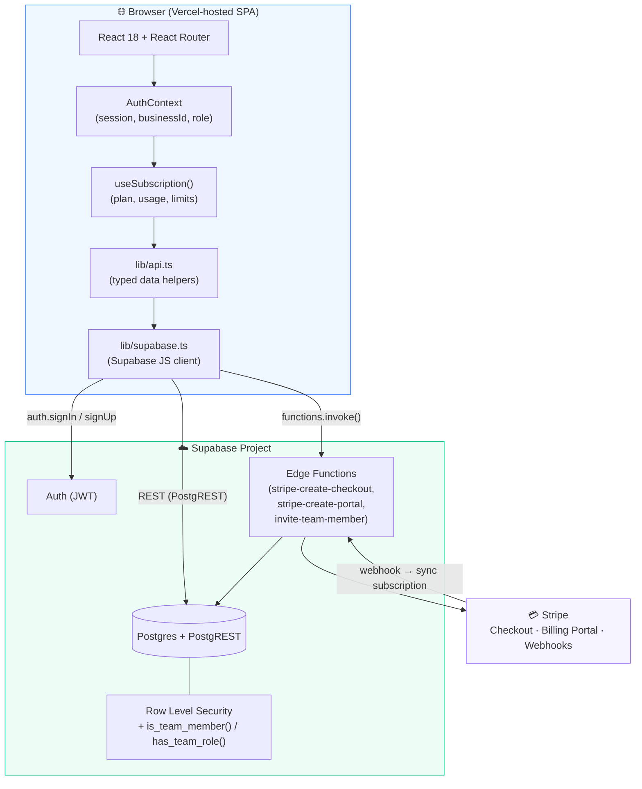
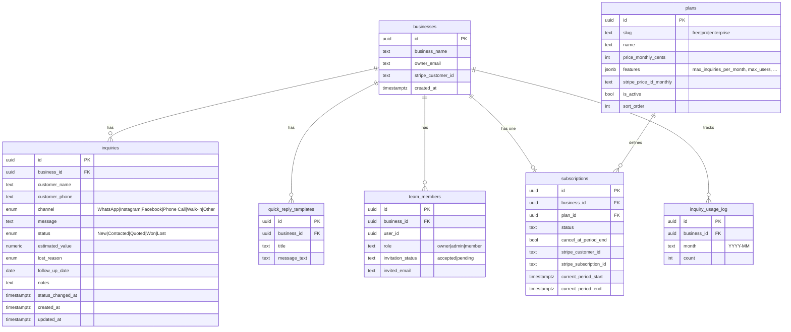
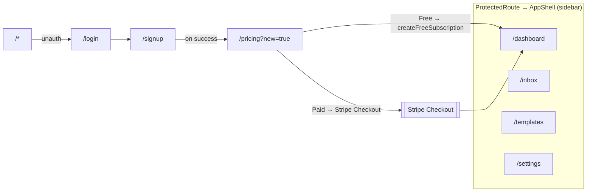
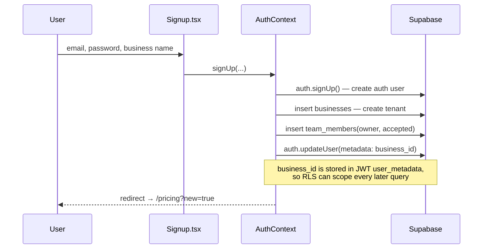
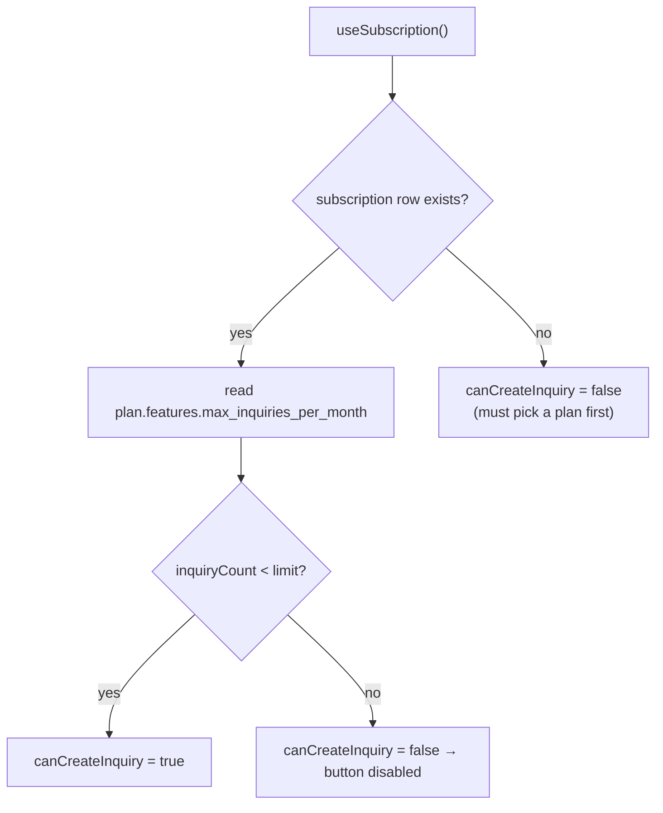
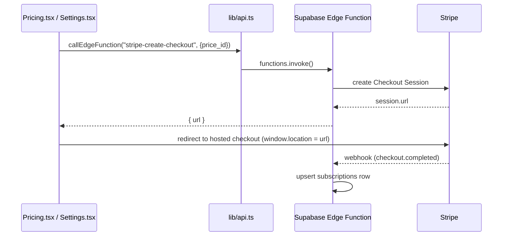
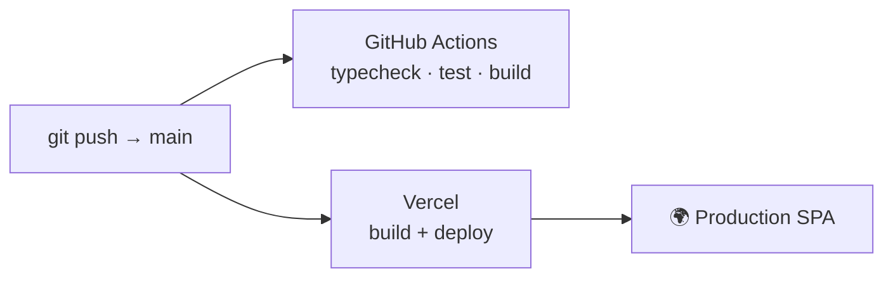

# LeadDesk

> A lightweight, multi-tenant **lead-tracking CRM** for small businesses. Owners log
> customer inquiries that arrive across channels (WhatsApp, Instagram, Facebook,
> phone, walk-in) and move each one through a simple sales pipeline —
> **New → Contacted → Quoted → Won / Lost** — with quick-reply templates, a metrics
> dashboard, team seats, and plan-based usage limits backed by Stripe billing.

---

## Table of contents

1. [What this is (and isn't)](#what-this-is-and-isnt)
2. [Tech stack](#tech-stack)
3. [High-level architecture](#high-level-architecture)
4. [Data model](#data-model)
5. [Repository structure](#repository-structure)
6. [Routing & screens](#routing--screens)
7. [Core flows](#core-flows)
8. [Multi-tenancy & security model](#multi-tenancy--security-model)
9. [Backend dependencies (Supabase)](#backend-dependencies-supabase)
10. [What makes this project different](#what-makes-this-project-different)
11. [Getting started](#getting-started)
12. [Scripts](#scripts)
13. [Testing](#testing)
14. [CI / CD & deployment](#ci--cd--deployment)
15. [Known gaps / not yet implemented](#known-gaps--not-yet-implemented)

---

## What this is (and isn't)

**It is** a manual CRM. The business owner *manually logs* each lead and tags which
channel it came from. The "channel" (WhatsApp, Instagram, …) is a **label**, not a
live integration.

**It is not** a social-inbox aggregator. There is **no** Meta / WhatsApp / Instagram
API, OAuth "connect your account" flow, or inbound webhook. Messages do **not**
flow in automatically. The only outbound social touch is a `wa.me` **click-to-chat**
deep link generated from a customer's phone number.

> If you want auto-importing of DMs, that's a future feature — see
> [Known gaps](#known-gaps--not-yet-implemented).

---

## Tech stack

| Layer | Technology | Notes |
|-------|-----------|-------|
| **UI framework** | React 18 + TypeScript | Function components + hooks |
| **Build tool** | Vite 5 | Dev server, HMR, production bundling |
| **Styling** | Tailwind CSS v4 | Via `@tailwindcss/vite`; theme tokens in `index.css` (OKLCH colors) |
| **Routing** | React Router 6 | `BrowserRouter`, nested protected routes |
| **Charts** | Recharts | Dashboard bar charts / trends |
| **Icons** | lucide-react + react-icons | `react-icons/si` for brand logos (Instagram/Facebook) |
| **Backend (BaaS)** | Supabase | Postgres + Auth + Row Level Security + Edge Functions |
| **Auth** | Supabase Auth | Email/password, JWT in `user_metadata` |
| **Payments** | Stripe | Checkout + Billing Portal via Supabase Edge Functions |
| **Testing** | Vitest + Testing Library | jsdom environment |
| **CI** | GitHub Actions | typecheck → test → build |
| **Hosting** | Vercel | SPA, auto-deploy on push to `main` |

This is a **client-heavy SPA + BaaS** architecture: there is **no custom Node/Express
backend**. The React app talks directly to Supabase (Postgres via PostgREST, Auth,
and Edge Functions). Security is enforced in the database via **Row Level Security**,
not in an app server.

---

## High-level architecture



**Request lifecycle (typical read):** a page calls a helper in `lib/api.ts` →
which uses the Supabase client (`lib/supabase.ts`) → PostgREST endpoint on Postgres
→ **RLS policies** filter rows to the caller's `business_id` → typed data returns to
the React component.

---

## Data model

Seven tables, all scoped to a `business` (the tenant). Enums drive the pipeline and
channel tagging.



**Plan limits live in `plans.features` (JSONB)** — e.g. Free = `max_inquiries_per_month: 50`,
`max_users: 1`; Pro/Enterprise = `null` (unlimited). The client reads these to gate
actions (see [usage limits](#3-usage-limits--plan-gating)).

---

## Repository structure

```
leaddesk/
├── App.tsx                      # Route table (public + protected)
├── main.tsx                     # React entry — mounts <App/>
├── index.html                   # Vite HTML shell
├── index.css                    # Tailwind import + @theme design tokens (OKLCH)
│
├── contexts/
│   └── AuthContext.tsx          # Session, businessId, role/isOwner, sign in/up/out
│
├── hooks/
│   └── useSubscription.ts       # Plan + usage + limit flags (canCreateInquiry, …)
│
├── components/
│   ├── AppShell.tsx             # Sidebar + topbar layout for protected routes
│   ├── ProtectedRoute.tsx       # Redirects unauthenticated users to /login
│   ├── KanbanBoard.tsx          # Pipeline columns by status
│   ├── InquiryModal.tsx         # Create / edit an inquiry
│   ├── InquiryDetail.tsx        # Side panel: status changes, notes, quick replies
│   ├── StatusBadge.tsx          # Colored status pill
│   └── *.test.tsx               # Component tests
│
├── pages/
│   ├── Login.tsx / Signup.tsx   # Auth screens (public)
│   ├── Pricing.tsx              # Plan selection → free activation or Stripe Checkout
│   ├── Dashboard.tsx            # Metrics + Recharts (consumes lib/metrics.ts)
│   ├── Inbox.tsx                # Inquiry list / Kanban + filters + "New Inquiry"
│   ├── Templates.tsx            # Quick-reply CRUD
│   └── Settings.tsx             # Business profile, billing, team management
│
├── lib/
│   ├── supabase.ts              # Supabase client (URL + anon key)
│   ├── api.ts                   # All typed data-access + callEdgeFunction()
│   ├── metrics.ts               # Pure computeDashboardMetrics() (unit-tested)
│   ├── database.generated.ts    # Supabase-generated DB types (source of truth)
│   └── database.types.ts        # Convenience aliases (Inquiry, Plan, …) re-exported
│
├── test/setup.ts                # Vitest + jest-dom setup
├── vite.config.ts               # Vite + Tailwind + Vitest config
├── vercel.json                  # SPA rewrite + Vite preset for Vercel
└── .github/workflows/ci.yml     # typecheck · test · build
```

---

## Routing & screens



| Route | Access | Purpose |
|-------|--------|---------|
| `/login`, `/signup` | Public | Email/password auth |
| `/pricing` | Public/auth | Plan selection (also post-signup landing) |
| `/dashboard` | Protected | KPIs: conversion rate, avg value, active leads, first-contact time, monthly trend |
| `/inbox` | Protected | Log/manage inquiries; pipeline + filters; gated "New Inquiry" |
| `/templates` | Protected | Reusable quick replies |
| `/settings` | Protected | Business profile · billing portal · team invites · usage |

Protected routes are wrapped by [`ProtectedRoute`](components/ProtectedRoute.tsx)
(redirects to `/login` when there's no session) and rendered inside
[`AppShell`](components/AppShell.tsx) (collapsible sidebar + topbar).

---

## Core flows

### 1. Authentication & tenant bootstrap



On every load, `AuthContext` calls `getSession()`, extracts `business_id` from
`user_metadata` (falling back to a DB lookup by `owner_email`), and fetches the
caller's `team_members` row to derive `role` / `isOwner`.

### 2. Inquiry pipeline

The pipeline status is a 5-stage enum. Status changes are written from the client
and **stamp `status_changed_at`** (used for the "average first-contact time" metric —
so this metric does **not** depend on a DB trigger).

```
New ──▶ Contacted ──▶ Quoted ──▶ Won
                              └──▶ Lost (+ lost_reason)
```

Inquiries are created via [`InquiryModal`](components/InquiryModal.tsx), grouped by
status in [`KanbanBoard`](components/KanbanBoard.tsx), and edited in
[`InquiryDetail`](components/InquiryDetail.tsx).

### 3. Usage limits & plan gating



`getInquiryUsage()` reads the current month's count from `inquiry_usage_log`, and
**falls back to counting inquiries directly** if no log row exists — so the usage
meter works even without a usage-logging trigger. The "+ New Inquiry" button in
[`Inbox`](pages/Inbox.tsx) is disabled when `canCreateInquiry` is false.

### 4. Billing (Stripe via Edge Functions)



The **Free** plan skips Stripe and calls `createFreeSubscription()` directly.
Manage/cancel uses `stripe-create-portal`; team invites use `invite-team-member`.

---

## Multi-tenancy & security model

There is no application server enforcing access — **Postgres Row Level Security is
the authorization layer.**

- Every tenant table carries a `business_id`.
- The user's `business_id` is embedded in their **JWT `user_metadata`**, sent on every
  request by the Supabase client.
- RLS policies (in the Supabase project, not this repo) restrict rows to the caller's
  business. Two SQL helper functions back the policies:
  - `is_team_member(business_id)` — is the caller a member of that business?
  - `has_team_role(business_id, role)` — does the caller hold a given role?
- The **anon key shipped in the client is safe** — it only grants what RLS allows.

> ⚠️ If RLS policies are missing or misconfigured, writes (e.g. activating the Free
> plan, saving an inquiry) fail even though the UI is correct. This is the most
> common cause of "buttons not working" — check policies before suspecting triggers.

---

## Backend dependencies (Supabase)

This repo is the **frontend only**. A working deployment also requires, in the
Supabase project:

| Dependency | What / why |
|-----------|------------|
| **7 tables** | `businesses, inquiries, quick_reply_templates, plans, subscriptions, team_members, inquiry_usage_log` |
| **Enums** | `inquiry_channel`, `inquiry_status`, `lost_reason` |
| **`plans` seed rows** | free / pro / enterprise with `features` JSON — without these, Pricing & limits break |
| **RLS policies** | per-table, plus `is_team_member()` / `has_team_role()` functions |
| **Edge Functions** | `stripe-create-checkout`, `stripe-create-portal`, `invite-team-member` |
| **Stripe config** | secret key as a function secret; price IDs stored in `plans.stripe_price_id_monthly`; a webhook to sync subscription status |

> These migrations/functions are **not currently version-controlled in this repo** —
> they live in the Supabase project. Adding SQL migrations + Edge Function source here
> is a recommended next step for reproducibility.

---

## What makes this project different

- **Server-less by design.** No Express/Nest backend — the SPA talks straight to
  Supabase, and **the database (RLS) is the security boundary**. Fewer moving parts,
  but it shifts correctness onto policy configuration.
- **Channel-as-a-tag, not an integration.** Unlike inbox aggregators (e.g. tools that
  OAuth into Meta), LeadDesk keeps lead capture **manual and channel-agnostic** — it
  works for phone calls and walk-ins, not just social DMs.
- **Pure, testable metric core.** Dashboard math is extracted into
  [`lib/metrics.ts`](lib/metrics.ts) (`computeDashboardMetrics`), a deterministic pure
  function with injectable `now` — making analytics unit-testable without a database.
- **JWT-embedded tenancy.** `business_id` rides in the auth token, so multi-tenant
  scoping needs no extra round-trips and is enforced uniformly by RLS.
- **Plan limits as data.** Gating rules live in `plans.features` JSON, so changing a
  plan's limits is a data edit, not a code change.
- **Modern styling pipeline.** Tailwind v4 with OKLCH design tokens declared directly
  in CSS (`@theme`), no separate `tailwind.config.js`.

---

## Getting started

```bash
npm install
npm run dev      # http://localhost:5173
```

The Supabase URL + **anon** key are in [`lib/supabase.ts`](lib/supabase.ts). The anon
key is public-safe; real access control is RLS. (To point at your own Supabase
project, replace those two values and provision the schema in
[Backend dependencies](#backend-dependencies-supabase).)

---

## Scripts

```bash
npm run dev        # Vite dev server (HMR)
npm run build      # tsc -b (typecheck) + vite build → dist/
npm run preview    # serve the production build locally
npm run typecheck  # tsc only
npm test           # run Vitest once
npm run test:watch # Vitest watch mode
```

---

## Testing

**Vitest + React Testing Library** (jsdom). Focused on pure logic and presentational
components — no live Supabase needed:

- [`lib/metrics.test.ts`](lib/metrics.test.ts) — conversion rate, monthly trend,
  this-month averaging, active-pipeline counting, first-contact time (timezone-safe).
- [`components/StatusBadge.test.tsx`](components/StatusBadge.test.tsx) — status →
  color mapping for all five statuses.

```bash
npm test    # 16 tests
```

---

## CI / CD & deployment



- **CI** — [`.github/workflows/ci.yml`](.github/workflows/ci.yml): on push/PR to
  `main`, runs `npm ci` → `typecheck` → `test` → `build` on Node 20.
- **Deploy** — [`vercel.json`](vercel.json): Vite preset, `dist/` output, and an SPA
  rewrite so deep links / refreshes resolve to `index.html`. Auto-deploys on push.

---

## Known gaps / not yet implemented

- **No real social-media integration** — channels are manual tags; no Meta/WhatsApp
  API, OAuth, or inbound webhooks. (Closest thing: `wa.me` click-to-chat link.)
- **Backend not version-controlled** — Supabase schema, RLS policies, and Edge
  Function source live only in the Supabase project; no SQL migrations in this repo.
- **Bundle size** — the production JS chunk is ~860 KB (one chunk); code-splitting by
  route is a known optimization.
- **Stripe requires configuration** — billing buttons depend on Stripe keys + price
  IDs + a webhook being set up in the Supabase project.
```
